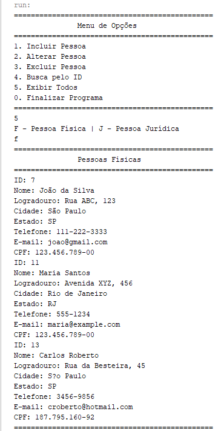

## CadastroBD
Criação de aplicativo Java, com acesso ao banco de dados SQL Server através do middleware JDBC.

### Versão do Software

* SQL Server Management Studio 19
* Microsoft SQL Server Express 2022
* NetBeans 18
* JDK 8

### Arquivos

* O arquivo **Loja.bak** contém uma cópia do banco utilizado. 
* O arquivo **RelatorioPratica.pdf** contém informações e análise sobre os procedimentos executados.

